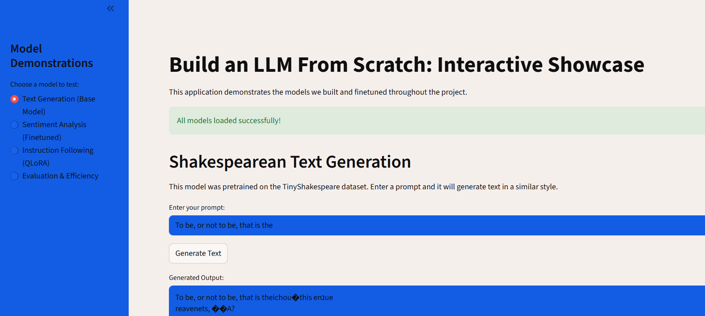
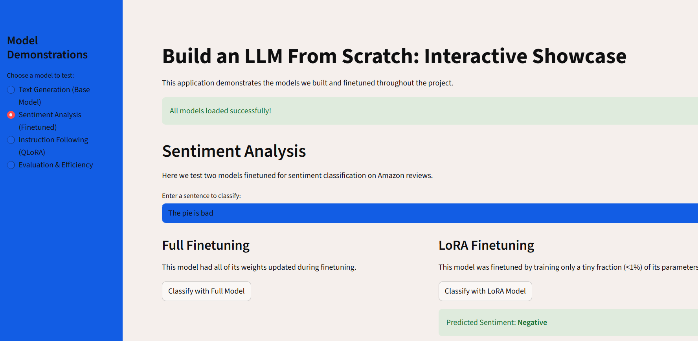
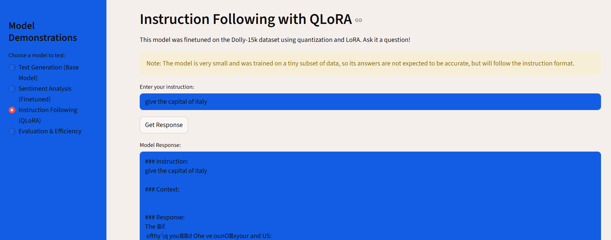

# 🧠 GPT from Zero: My LLM Implementation Journey

> *"The best way to understand something is to build it yourself"*

This is my personal exploration into the inner workings of Large Language Models through implementing a complete GPT-style architecture from the ground up. No pre-built transformers, no shortcuts—just pure PyTorch and a deep dive into understanding how modern AI systems work.

## ✨ What Makes This Project Special?

This isn't just another "hello world" ML project. I built production-quality code that demonstrates the complete lifecycle of modern language models:

### 🏗️ **Foundation to Frontier**
- Started with basic tokenization and progressed to state-of-the-art techniques
- Every line of code written from scratch with clear implementation
- Bridged the gap between theory and practical implementation

### 🎯 **Implemented Components**
- **Base Model**: GPT-style architecture with autoregressive training on TinyShakespeare dataset
- **Sentiment Classification**: Amazon product review sentiment analysis with full parameter fine-tuning  
- **LoRA Fine-tuning**: Parameter-efficient adaptation using Low-Rank matrices
- **QLoRA**: 4-bit quantization combined with LoRA for instruction-following on Dolly-15k dataset

### 🚀 **Interactive Streamlit Dashboard**
A comprehensive web application featuring:
- Text generation from the base Shakespeare model with temperature and top-k sampling
- Sentiment classification testing with both full and LoRA fine-tuned models  
- Model performance comparison and evaluation metrics
- Real-time interaction with all trained model variants

---

## 🎪 Live Demo

*Screenshots of my implementation will be added here*





---

## 🗂️ Codebase Architecture

This codebase is thoughtfully organized into logical components, each serving a specific purpose in the LLM pipeline:

```
📦 Build-LLM-from-Scratch/
├── 🧠 Core Architecture
│   ├── model.py              # GPT model, transformer blocks, classification wrapper
│   ├── tokenizer.py          # BPE tokenizer implementation
│   └── lora.py              # LoRA layer for parameter-efficient fine-tuning
│
├── 🔄 Training & Data Pipeline  
│   ├── training.py           # Training loop and optimization
│   ├── data_utils.py         # Data preprocessing and batch creation
│   ├── data_loader.py        # Text downloading utilities
│   └── main.py              # Base model training on TinyShakespeare
│
├── 🎯 Fine-tuning Implementations
│   ├── finetune_classifier.py       # Full fine-tuning for sentiment analysis
│   ├── finetune_lora_classifier.py  # LoRA-based sentiment classification
│   └── finetune_qlora_instructions.py # QLoRA instruction following (Dolly-15k)
│
├── 🔬 Evaluation & Generation
│   ├── evaluate.py           # Perplexity calculation for model evaluation
│   ├── generation.py         # Text generation with temperature/top-k sampling
│   └── app.py               # Streamlit web application
│
└── 💾 Trained Models
    └── models/              # Pre-trained model checkpoints (.pth files)
```

### 🔍 Component Deep Dive

| Component | Implementation | Purpose |
|-----------|---------------|---------|
| **🔤 BPE Tokenizer** | Byte-Pair Encoding with merge operations | Text-to-token conversion and vocabulary building |
| **🧠 GPT Architecture** | Self-attention, multi-head attention, transformer blocks | Core language modeling components |
| **🏋️ Training Loop** | AdamW optimizer, cross-entropy loss, gradient descent | Model parameter optimization |
| **🎛️ Text Generation** | Temperature scaling, top-k sampling, autoregressive decoding | Controllable text generation |
| **⚡ LoRA** | Low-rank adaptation matrices | Efficient fine-tuning with <1% parameters |
| **🔥 QLoRA** | 4-bit quantization + LoRA | Memory-efficient instruction tuning |

---

## 🚀 Project Setup

### Step 1: Environment Setup
```bash
# Clone and setup
git clone <repo-url>
cd Build-LLM-from-Scratch

# Conda environment (recommended)
conda create -n llm-scratch python=3.9
conda activate llm-scratch

# Install dependencies
pip install -r requirements.txt
```

### Step 2: Train Base Model
```bash
python main.py
```
*⏱️ Takes ~5-10 minutes on GPU, longer on CPU*

### Step 3: Run Fine-tuning Experiments

Implemented fine-tuning approaches for different use cases:

```bash
# 🎯 Full fine-tuning on Amazon sentiment data (all parameters updated)
python finetune_classifier.py

# ⚡ LoRA fine-tuning (efficient adaptation with <1% parameters)  
python finetune_lora_classifier.py

# 🔥 QLoRA instruction tuning (4-bit quantization + LoRA on Dolly-15k)
python finetune_qlora_instructions.py
```

### Step 4: Interactive Exploration
```bash
streamlit run app.py
```
Launch the interactive dashboard! 🎉

---

## 🧪 My Implementation Journey

This project was built as a progressive exploration, with each phase building upon the previous one, introducing increasingly sophisticated concepts.

### 🌱 **Phase 1: Foundation Implementation**
**Focus**: Core building blocks
- BPE tokenizer with merge operations and vocabulary building
- Token and positional embedding layers
- Data loading and preprocessing pipelines

**Key Implementation**: *Character-level to subword tokenization using iterative pair merging*

### 🏗️ **Phase 2: Transformer Architecture** 
**Focus**: Attention mechanisms
- Single-head and multi-head self-attention layers
- Causal masking for autoregressive generation
- Transformer blocks with residual connections and layer normalization
- Complete GPT model assembly

**Key Implementation**: *Scaled dot-product attention with causal masking for next-token prediction*

### 🎓 **Phase 3: Model Training**
**Focus**: Optimization and learning
- Cross-entropy loss for language modeling
- AdamW optimizer with learning rate scheduling
- Training loop with gradient computation and backpropagation
- Model checkpointing and weight persistence

**Key Implementation**: *Autoregressive training on TinyShakespeare with next-token prediction objective*

### 🎯 **Phase 4: Task Specialization**
**Focus**: Adaptation techniques
- Classification head for sentiment analysis
- LoRA implementation with low-rank matrices (rank=8)
- QLoRA with 4-bit quantization using bitsandbytes
- Instruction following on Dolly-15k dataset

**Key Implementation**: *Parameter-efficient adaptation preserving base model while adding task-specific capabilities*

---

## 💡 Implementation Challenges Solved

Building this project required solving several practical engineering challenges:

### 🔧 **Device Compatibility**
```python
# Problem: GPU-trained models fail to load on different devices
model.load_state_dict(torch.load('model.pth'))  # ❌ Device mismatch

# Solution: Device-agnostic loading implemented in all scripts
model.load_state_dict(torch.load('model.pth', map_location='cpu'))  # ✅ Portable
```

### 🔤 **Vocabulary Validation**
```python
# Problem: QLoRA sees tokens outside Shakespeare vocabulary range
tokens = tokenizer.encode("modern_instruction_text")  # ❌ Unknown tokens

# Solution: Combined corpus training and token validation in finetune_qlora_instructions.py
combined_text = shakespeare_text + "\n" + "\n".join(formatted_texts)
bpe_tokenizer.train(combined_text, VOCAB_SIZE)  # ✅ Unified vocabulary
```

### � **Idempotent Model Modifications**
```python
# Problem: Streamlit re-runs code, double-wrapping layers
layer = LoRALayer(layer)  # First run: ✅
layer = LoRALayer(layer)  # Second run: ❌ Error

# Solution: Check before modifying
if isinstance(layer, torch.nn.Linear):
    layer = LoRALayer(layer)  # ✅ Safe
```

### 📊 **Quality vs Scale Trade-offs**
The most important lesson: our small model produces imperfect results not due to bugs, but due to **scale**. Modern LLMs succeed through:
- Billions of parameters (vs our thousands)
- Massive datasets (vs our small Shakespeare corpus)  
- Sophisticated training infrastructure

**This isn't a limitation—it's a feature!** It demonstrates that the core concepts can be understood and implemented without needing Google-scale resources.

---

## 🎯 Technical Implementations Achieved

Through this project, I successfully implemented:

- ✅ **Transformer Architecture**: Multi-head self-attention, positional encodings, causal masking
- ✅ **Training Systems**: AdamW optimization, cross-entropy loss, gradient computation
- ✅ **Transfer Learning**: Base model adaptation for sentiment classification tasks
- ✅ **Efficiency Techniques**: LoRA (rank=8), QLoRA with 4-bit quantization
- ✅ **Evaluation Methods**: Perplexity calculation, classification accuracy metrics
- ✅ **Generation Control**: Temperature scaling, top-k sampling for text generation
- ✅ **Production Features**: Model checkpointing, device management, error handling

**Core Achievement**: Built a complete LLM pipeline from tokenization to deployment, demonstrating that transformer architecture principles can be implemented and understood without industrial-scale resources.

---

## 🤝 Project Notes

This is a personal learning project focused on understanding LLM internals through implementation. The code is organized for clarity and educational value, demonstrating the complete pipeline from tokenization to deployment.

---

## 📚 References

- [Attention Is All You Need](https://arxiv.org/abs/1706.03762) - The original Transformer paper
- [LoRA: Low-Rank Adaptation](https://arxiv.org/abs/2106.09685) - Parameter-efficient fine-tuning
- [QLoRA: Efficient Finetuning](https://arxiv.org/abs/2305.14314) - Quantization + LoRA

---

**Implementation Complete! 🚀**

*The goal was never to build the next ChatGPT, but to understand how it works. Mission accomplished.*
